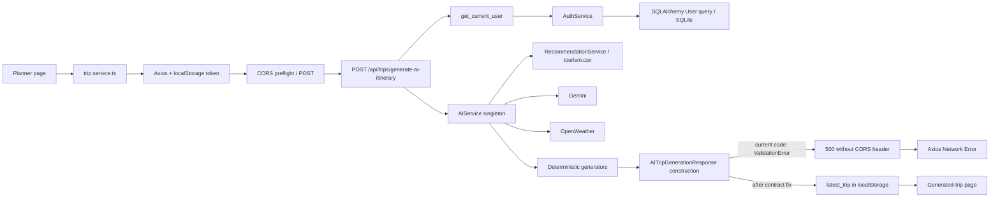

# TripGenius Full-Stack Code Audit

Audit date: 2026-06-11

Scope: all application Python/TypeScript/TSX/CSS files, manifests, lockfile metadata,
environment-variable contracts, SQL/documentation/prompt files, SQLite schema, CSV
datasets, and public asset signatures. Generated/vendor files were verified through
their manifests and runtime checks rather than reviewed line by line.

## Executive Result

TripGenius is not production-ready. The frontend production build succeeds, all
backend modules compile/import when the root Python environment is used from the
`backend` directory, and the committed SQLite database passes `integrity_check`.
However, the normal UI cannot authenticate with the backend, and a validly
authenticated planner request always crashes while constructing its response.

The direct underlying cause of the planner's literal Axios `Network Error` is:

1. `backend/app/api/trip.py:251` constructs `AITripGenerationResponse` with
   `success`, `message`, and a dictionary-valued `itinerary`.
2. `backend/app/schemas/trip_schema.py:386` instead requires `trip_title`,
   `destination`, a list-valued `itinerary`, structured attractions/hotels/
   restaurants, weather, sustainability, and cost breakdown.
3. Pydantic raises an unhandled 11-field `ValidationError`.
4. The resulting HTTP 500 has no `Access-Control-Allow-Origin` header, even for
   `http://localhost:3000`, so a browser/Axios client reports `Network Error`.

This was reproduced with an isolated valid user and fake AI provider:

```text
POST /api/trips/generate-ai-itinerary
status: 500
access-control-allow-origin: absent
body: Internal Server Error
```

The shipped login/register UI is a separate earlier blocker: it stores fake tokens,
so the normal UI sends `Bearer demo_token` or `Bearer registered_user` and receives
401 before AI generation begins.

## Verification Performed

- `npm run build`: passed; all 19 app routes compiled and prerendered as applicable.
- `npm run lint`: failed because `next lint` opens an interactive setup prompt and
  is deprecated; no ESLint configuration exists.
- `python -m compileall backend/app`: passed.
- Every backend module imported successfully using the root `.venv` from
  `D:\tripgenius\backend`.
- `pip check`: passed in the root `.venv`.
- `backend/venv` cannot import FastAPI.
- `backend/requirements.txt` is empty.
- All public PNG/JPEG/SVG assets have valid file signatures.
- `database/tourism.csv` and `backend/tourism.csv` are byte-identical.
- SQLite `integrity_check`: `ok`.
- SQLite `PRAGMA foreign_keys`: `0` (disabled).
- No project tests were found.
- Gemini/OpenWeather live calls were not executed to avoid consuming external API
  quota; their code paths and configured-key presence were inspected.

## Prioritized Findings

### P0-1: Planner Response Construction Always Crashes

Files:

- `backend/app/api/trip.py:218-256`
- `backend/app/schemas/trip_schema.py:386-409`
- `backend/app/services/ai_service.py:1329-1380`

Root cause: the route, response schema, and AI service define three incompatible
JSON contracts. The route creates an envelope, the schema expects a flat structured
trip, and the AI service returns a differently named flat dictionary containing
string lists and `ai_itinerary`.

Why it fails: `AITripGenerationResponse(...)` raises inside the route. The response
never reaches JSON serialization.

Severity: blocker.

Compatible correction: keep an envelope but define its inner type to match the
actual generated output and merge request context into the generated result.

```python
# backend/app/schemas/trip_schema.py
class GeneratedDaySchema(BaseModel):
    day: int
    title: str
    destination: str
    morning: str
    afternoon: str
    evening: str

class GeneratedTripSchema(BaseModel):
    destination: str
    duration_days: int
    budget: float
    travelers_count: int
    travel_style: str | None = None
    transportation_mode: str | None = None
    preferred_accommodation: str | None = None
    interests: list[str] = Field(default_factory=list)
    trip_title: str
    destination_summary: str | None = None
    ai_itinerary: list[GeneratedDaySchema] = Field(default_factory=list)
    attractions: list[str] = Field(default_factory=list)
    recommended_hotels: list[str] = Field(default_factory=list)
    recommended_restaurants: list[str] = Field(default_factory=list)
    weather_summary: dict = Field(default_factory=dict)
    packing_checklist: list[str] = Field(default_factory=list)
    travel_tips: list[str] = Field(default_factory=list)

class AITripGenerationResponse(BaseModel):
    success: bool
    message: str
    itinerary: GeneratedTripSchema
```

```python
# backend/app/api/trip.py
generated = ai_service.generate_trip_plan(...)
itinerary = {**payload.model_dump(), **generated}
return AITripGenerationResponse(
    success=True,
    message="AI itinerary generated successfully",
    itinerary=itinerary,
)
```

### P0-2: Login and Registration Never Authenticate Against FastAPI

Files:

- `frontend/src/app/login/page.tsx:19-68`
- `frontend/src/app/register/page.tsx:96-170`
- `frontend/src/services/auth.service.ts:80-125`
- `backend/app/api/auth.py:88-152`

Root cause: login and registration pages do not import or call `authService`.
They accept any input, create local mock users, and store fake tokens.

Why it fails: `frontend/src/services/trip.service.ts:57-69` sends the fake token to
the protected planner route. `backend/app/api/trip.py:99-127` rejects it.

Severity: blocker and authentication-security defect.

Compatible correction:

```tsx
// login/page.tsx
const login = await authService.login({ email, password });
const user = await authService.getProfile();
localStorage.setItem("tripgenius_user", JSON.stringify(user));
router.push("/dashboard");
```

```tsx
// register/page.tsx
await authService.register({
    full_name: form.full_name,
    email: form.email,
    password: form.password,
});
await authService.login({ email: form.email, password: form.password });
router.push("/dashboard");
```

### P0-3: Planner Result and Generated Page Expect Different JSON

Files:

- `frontend/src/app/planner/page.tsx:66-101`
- `frontend/src/app/trip/generated/page.tsx:8-18`
- `frontend/src/app/trip/generated/page.tsx:335-350`

Root cause: the planner stores the complete API envelope as `latest_trip`, while the
generated page expects a flat object containing request fields such as `budget` and
`duration_days`. The AI service does not return those request fields.

Why it fails: after only fixing the backend response validation, calls such as
`trip.budget.toLocaleString()` can throw because `budget` is undefined.

Severity: blocker after P0-1 is fixed.

Compatible correction:

```tsx
const response = await tripService.generateAIItinerary(payload);
localStorage.setItem("latest_trip", JSON.stringify(response.itinerary));
```

Define and use one shared `GeneratedTrip` TypeScript interface instead of `any`.

### P0-4: CORS Configuration Produces Browser-Level Network Errors

Files:

- `backend/app/main.py:60-67`
- `backend/app/core/config.py:42-69`
- `backend/.env` (`CORS_ORIGINS`)
- `frontend/src/services/trip.service.ts:6-8`
- `frontend/src/services/auth.service.ts:6-8`

Root cause: backend CORS allows only `http://localhost:3000`. The frontend defaults
its API target to `http://127.0.0.1:8000`, and developers may open Next.js at
`http://127.0.0.1:3000`.

Verified behavior:

```text
OPTIONS from http://localhost:3000 -> 200 with CORS header
OPTIONS from http://127.0.0.1:3000 -> 400 without CORS header
```

Severity: blocker for the 127.0.0.1 frontend origin and any undeclared deployment
origin.

Compatible correction:

```env
CORS_ORIGINS=http://localhost:3000,http://127.0.0.1:3000
```

Add a committed `frontend/.env.example` with `NEXT_PUBLIC_API_URL`, set real
production origins per environment, and ensure unexpected exceptions are converted
to JSON responses that also receive CORS headers.

### P0-5: Documented Backend Installation Is Broken

Files:

- `README.md` backend setup section
- `backend/requirements.txt`
- `requirements.txt`
- `backend/venv`

Root cause: README instructs `cd backend` then
`pip install -r requirements.txt`, but that file is empty. The committed
`backend/venv` cannot import FastAPI. Dependencies are only declared at repository
root.

Severity: deployment/setup blocker.

Correction: use one dependency manifest and one ignored virtual environment. Either
populate `backend/requirements.txt` and keep the README command, or update the README
to install `../requirements.txt`. Do not commit virtual environments.

### P0-6: Recommendation and Database Paths Depend on Process CWD

Files:

- `backend/app/services/recommendation_service.py:41-56`
- `backend/app/core/config.py:53-61`
- `backend/app/database/db.py:15-29`

Root cause: recommendation loading uses `Path.cwd().parent`, ignoring the robust
configured dataset path. SQLite uses the relative URL `sqlite:///./tripgenius.db`.

Verified behavior:

```text
cwd D:\tripgenius\backend -> recommendation dataset loads, DB is backend/tripgenius.db
cwd D:\tripgenius -> dataset lookup is D:\database\tourism.csv and fails;
                     DB resolves to D:\tripgenius\tripgenius.db
```

Severity: blocker under IDE, service manager, or alternate launch-directory setups.

Compatible correction:

```python
# recommendation_service.py
from app.core.config import settings

def _load_dataset(self) -> pd.DataFrame:
    return pd.read_csv(settings.tourism_dataset_path).fillna("")
```

Resolve SQLite to an absolute backend path before `create_engine`.

### P1-1: History and Statistics APIs Are Unusable

Files:

- `frontend/src/services/trip.service.ts:163-183`
- `backend/app/api/trip.py:450-509`
- `backend/app/schemas/trip_schema.py:340-369`
- `backend/app/services/trip_service.py:250-308`

Root causes:

- Frontend requests `/api/trips/history` and `/api/trips/statistics`.
- Backend exposes `/api/trips/history/list` and `/api/trips/statistics/summary`.
- `TripHistoryResponse` describes one trip, while the route passes
  `{total_trips, trips}`.
- Statistics service keys do not match `TripStatisticsResponse`.

Severity: high.

Corrections:

```ts
this.api.get("/api/trips/history/list");
this.api.get("/api/trips/statistics/summary");
```

```python
class TripHistoryResponse(BaseModel):
    total_trips: int
    trips: list[TripResponse]
```

Update `get_trip_statistics()` to return `completed_trips`, `total_budget_spent`,
`average_trip_budget`, and `average_sustainability_score`, matching its schema.

### P1-2: Most Advertised Backend Features Are Missing or Mocked

Files:

- `backend/app/api/profile.py` (empty)
- `backend/app/api/weather.py` (empty)
- `backend/app/database/seed.py` (empty)
- `frontend/src/app/forgot-password/page.tsx:50-63`
- `frontend/src/app/reset-password/page.tsx:90-110`
- `frontend/src/app/ai-chat/page.tsx:126-169`
- profile/settings/history/favorites/saved pages

Root cause: forgot-password calls a nonexistent endpoint; reset password and AI chat
are simulated; profile, settings, history, favorites, and saved trips are primarily
localStorage-only. The auth service is unused by pages.

Severity: high functional incompleteness.

Correction: implement and include the missing routers, or remove/label mocked UI.
Use backend services as the single source of truth.

### P1-3: Generated Itineraries Are Never Persisted

Files:

- `backend/app/api/trip.py:218-256`
- `backend/app/services/trip_service.py:185-206`
- `frontend/src/app/trip/generated/page.tsx:85-136`

Root cause: the AI route has no `TripService` dependency and never creates a `Trip`.
The existing `save_generated_itinerary()` method is unused. The Save button stores
only in localStorage.

Severity: high data-loss/feature defect.

Correction: generate and save in one database transaction, return the saved trip ID,
and make history/favorites use backend endpoints.

### P1-4: Frontend Trip State Is Fragmented Across Incompatible Keys

Files: `/history`, `/trip/history`, `/trip/saved`, `/favorites`, and generated-trip
pages.

Root cause: independent pages use `trip_history`, `saved_trips`,
`tripgenius_saved_trips`, `favorite_trips`, and `latest_trip`. They define different
trip interfaces and never synchronize.

Severity: high consistency defect.

Correction: replace these stores with typed backend queries plus one cache/state
layer. At minimum, use a single storage key and schema version.

### P1-5: AI/Weather Execution Can Exceed the Frontend Timeout

Files:

- `backend/app/services/ai_service.py:200-243`
- `backend/app/services/ai_service.py:1152-1181`
- `backend/app/services/ai_service.py:1211-1266`
- `backend/app/services/weather_service.py:25-31`
- `frontend/src/services/trip.service.ts:48-50`

Root cause: `_generate_content()` retries three times and is itself wrapped by
another three-retry loop, allowing nine Gemini calls. Weather may be fetched twice
per successful generation, each with a 15-second timeout. Axios times out after
60 seconds.

Severity: high reliability/cost risk.

Correction: keep one bounded retry policy, add explicit Gemini timeouts, fetch
weather once, pass it into packing generation, and use a queued/background job if
generation can exceed the HTTP request budget.

### P1-6: Database Lifecycle Is Not Production-Safe

Files:

- `backend/app/database/db.py:24-54`
- `backend/app/main.py:21-35`
- `backend/app/models/trip.py`
- `database/schema.sql` (empty)

Root cause: startup uses `create_all`, which cannot migrate existing tables.
No Alembic setup exists. SQLite foreign keys are disabled, so `ondelete="CASCADE"`
does not work. Money is stored as `Float`.

Severity: high for production/data integrity.

Correction: add Alembic migrations, enable SQLite foreign keys during development,
use PostgreSQL for production, and store money as `Numeric`/decimal or integer
minor units.

```python
@event.listens_for(engine, "connect")
def enable_sqlite_foreign_keys(dbapi_connection, _):
    dbapi_connection.execute("PRAGMA foreign_keys=ON")
```

### P1-7: Authentication and API-Cost Security Gaps

Files:

- `backend/app/core/security.py`
- `backend/app/api/auth.py`
- `backend/app/api/trip.py`
- `frontend/src/services/auth.service.ts:186-224`

Root causes:

- JWT consumers do not enforce a token `type`; a signed non-access token can be
  treated as an access token when its subject matches a user ID.
- JWTs are kept in localStorage, increasing XSS impact.
- No login/register/AI rate limiting or AI quota enforcement exists.
- `APP_DEBUG=True` enables SQL echo.
- API keys and a secret are present in `backend/.env`; they must never be committed
  or distributed and should be rotated if exposed.

Severity: high.

Correction: add `type="access"` and verify it, prefer secure HttpOnly cookies or a
carefully designed token strategy, rate-limit costly/auth endpoints, disable debug
in production, and use a secret manager.

### P1-8: Error Handling and Transactions Can Leave Inconsistent Data

Files:

- `backend/app/services/auth_service.py`
- `backend/app/services/trip_service.py`
- `backend/app/api/trip.py:282-298`
- `backend/app/main.py:122-135`

Root cause: service commits have no rollback handling. Trip creation commits before
the separate user trip-count update, so a later failure leaves partial state.
`/status` always claims every dependency is healthy without checking them.

Severity: high.

Correction: use transaction scopes, rollback on exceptions, atomically create the
trip and update counters, log sanitized errors, and implement real health probes.

### P2 Findings

1. `frontend/src/app/trip/[tripId]/page.tsx:6-34` ignores `tripId` and always loads
   `latest_trip`.
2. `frontend/src/app/trip/generated/page.tsx:96-105` builds IDs with absent
   `generated_at`, causing duplicate detection collisions.
3. `TripResponse` omits all detailed JSON fields even though `serialize_trip()`
   supplies them; Pydantic silently ignores the extras.
4. `TripUpdateRequest` accepts arbitrary status values and lacks string-length
   constraints.
5. Email addresses are not normalized before uniqueness checks.
6. `get_current_user()` catches its own `HTTPException` and masks specific failures
   as `Invalid token`.
7. Recommendation methods repeatedly use `iterrows()` and rescan the dataset.
8. AI-generated Gemini JSON is stored under `gemini_response` but not used to build
   the primary itinerary.
9. Empty prompt files are unused; prompt text is hard-coded in `ai_service.py`.
10. Duplicate datasets and duplicate root/frontend `package.json` files create
    configuration drift.
11. Empty SQL, docs, seed, profile-route, weather-route, and prompt files advertise
    structure without implementation.
12. Many unused schemas, constants, token helpers, and service methods are dead code.
13. Frontend API methods use `any`, weakening contract checking.
14. Large base64 profile images and generated itineraries in localStorage can exceed
    browser quota.
15. No route guards/middleware protect authenticated frontend pages.
16. No tests exist, and the configured lint command is nonfunctional.
17. The frontend has no production API environment file; its fallback points each
    deployed user's browser at their own `127.0.0.1`.
18. Root `package.json` duplicates the frontend manifest but cannot run Next.js from
    the repository root because the app lives under `frontend`.

## Actual Planner Execution Flow



Actual order after authentication:

1. Planner validates only non-empty destination and creates the request payload.
2. Axios reads `tripgenius_token`, adds `Authorization`, and starts a 60-second timer.
3. Browser checks CORS.
4. FastAPI authenticates the token and queries the user.
5. `get_ai_service()` initializes Gemini and loads the CSV on first use.
6. Gemini is called first, with nested retries.
7. If Gemini succeeds, deterministic output is built using recommendation data and
   two possible weather calls. Gemini JSON is only attached as an extra field.
8. If Gemini fails, a smaller offline fallback is returned.
9. The route constructs an incompatible Pydantic response and crashes.
10. Browser sees a 500 without CORS headers and Axios reports `Network Error`.
11. After the response-contract fix, the planner must store `response.itinerary`,
    not the envelope, before rendering.

## Files That Must Be Modified

Immediate blockers:

- `backend/app/api/trip.py`
- `backend/app/schemas/trip_schema.py`
- `backend/app/services/ai_service.py`
- `backend/app/services/recommendation_service.py`
- `backend/app/core/config.py`
- `backend/app/database/db.py`
- `backend/app/main.py`
- `backend/requirements.txt`
- `frontend/src/services/trip.service.ts`
- `frontend/src/app/planner/page.tsx`
- `frontend/src/app/trip/generated/page.tsx`
- `frontend/src/app/login/page.tsx`
- `frontend/src/app/register/page.tsx`
- backend and frontend environment examples/configuration

Required for complete advertised functionality:

- `backend/app/api/auth.py`
- `backend/app/api/profile.py`
- `backend/app/api/weather.py`
- `backend/app/services/auth_service.py`
- `backend/app/services/trip_service.py`
- all frontend profile/settings/history/favorites/saved/password-reset/AI-chat pages
- migration configuration and test suites
- ESLint configuration and package scripts
- README/docs

## Production-Readiness Checklist

- [x] Frontend production build completes.
- [x] Backend Python source compiles and imports in one known environment/CWD.
- [x] SQLite file passes integrity check.
- [ ] Normal UI registration/login produces a valid backend JWT.
- [ ] Planner returns a schema-valid JSON response.
- [ ] Planner result renders without shape/runtime errors.
- [ ] All supported frontend origins and production API URLs are configured.
- [ ] Backend installation is reproducible from documented commands.
- [ ] Paths are independent of process CWD.
- [ ] Generated trips, history, favorites, and profiles use one persistent backend.
- [ ] Password reset, profile, weather, and AI-chat features are implemented.
- [ ] Database migrations and foreign-key enforcement exist.
- [ ] External calls have bounded retries/timeouts and do not exceed HTTP limits.
- [ ] JWT type validation, secure token storage, rate limiting, and quota controls exist.
- [ ] Secrets are managed outside the repository and debug mode is disabled.
- [ ] Transactions rollback correctly and health checks test real dependencies.
- [ ] Linting and automated backend/frontend/end-to-end tests pass.

Final verdict: not production-ready.
